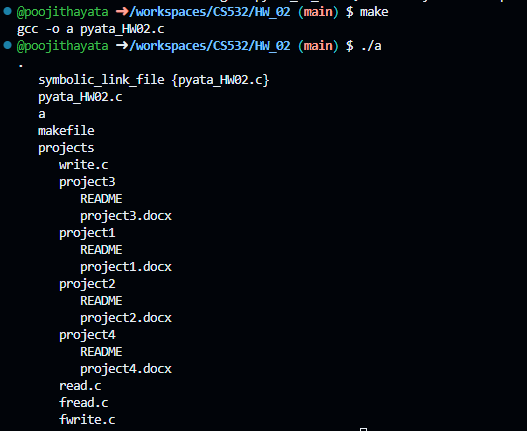
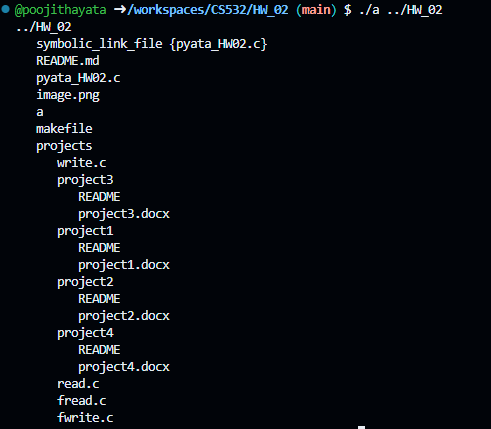
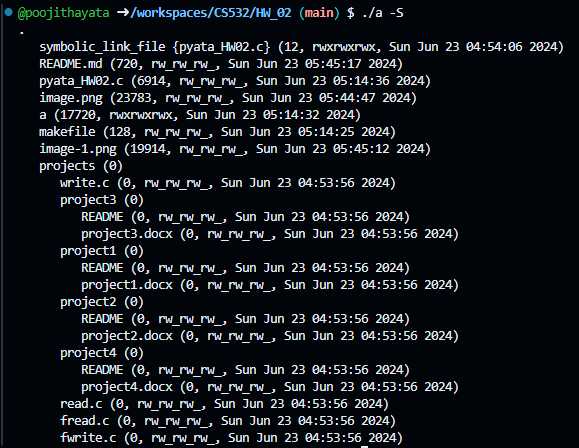
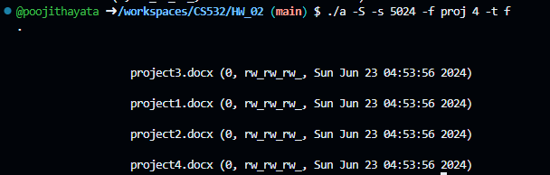

# PROJECT : HW_02
- To implement a c progam for search system call that prints the directories and files in hireracal manner with options -S, -s, -f, -t f and -t d.

# COMPILATION & EXECUTION
- We can compile the program with 
    - make 
    - gcc -o a pyata_HW_02.c
- This compilation command convers the c file into executable a file.
- Now execute the following command : 
    - ./a
    - ./a ../HW_02
    - ./a ../HW_01
    - ./a -S
    - ./a -s 5024
    - ./a -f proj 4
    - ./a -t f
    - ./a -t d
    - ./a -S -s 5024 -f proj 4 -t f

# PROGRAM
- The program calls the directories_and_files and depending on the options it prints the outputs.
- The outputs are : 

