# PROJECT : HW_02
- To implement a c progam for search system call that prints the directories and files in hireracal manner with options -S, -s, -f, -t f, -t f, -e and -E

# COMPILATION & EXECUTION
- We can compile the program with 
    - make 
    - gcc -o a pyata_HW_03.c
- This compilation command convers the c file into executable a file.
- Now execute the following command : 
    - ./a
    - ./a ../HW_02
    - ./a ../HW_03
    - ./a -S
    - ./a -s 5024
    - ./a -f proj 4
    - ./a -t f
    - ./a -t d
    - ./a -S -s 5024 -f proj 4 -t f
    - ./a -S -e 'ls -l'
    - ./a -f png 3 -E 'tar cvf png.tar'
    - ./a -s 1024 -f png 3 -e 'wc'

# PROGRAM
- The program calls the directories_and_files and depending on the options it prints the outputs.
- The main function has the following options :     
    1. option_S
    2. Option_s, option_s_max_file_size
    3. option_f_stringPattern, option_f_max_depth
    4. option_t, option_tf, option_td
    5. option_e, each_Command
    6. option_E, all_Command
- These variable values are assigned based on the arguments that are specified.
- Then the main function calls the directories_and_files function to print the files hireracally.
- Depending on the options or arguments passed, the function will call the following function :     
    - symbolic_link_file : This function returns the sysmbolic link file
    - file_permissions : This function prints the permission of the files
    - print_option_S : this function prints teh details of the files that passed.
    - EachFile_Command : This function creates a child and executes each file with the command passed with -e option.
    - AllFile_Command : This function creates a child and executes the all the files with command passed with -E
- pointerAsFunction function is used to pass the function as a pointer.

# The outputs are :
1. ./a
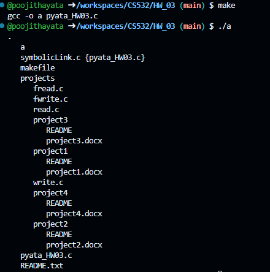
2. ./a ../HW_03
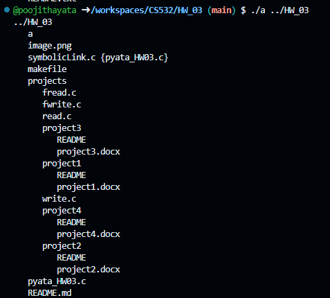
3. ./a projects/project1
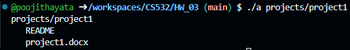
4. ./a -S
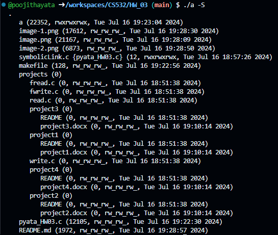
5. ./a -s 2024
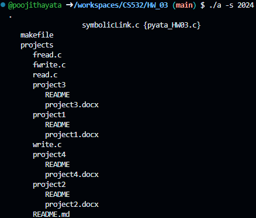
6. ./a -f png 4
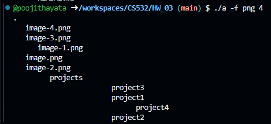
7. ./a -t f
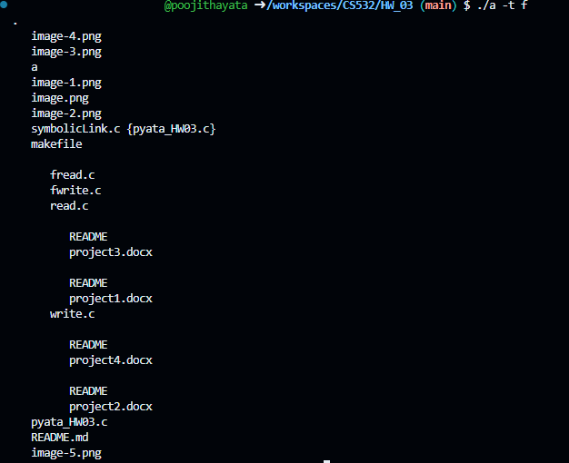
8. ./a -S -t d
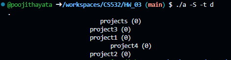
9. ./a -S -e 'ls -l' projects
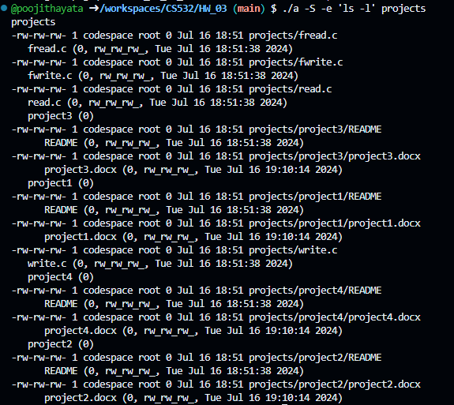
10. ./a -f png 3 -E 'tar cvf png.tar'
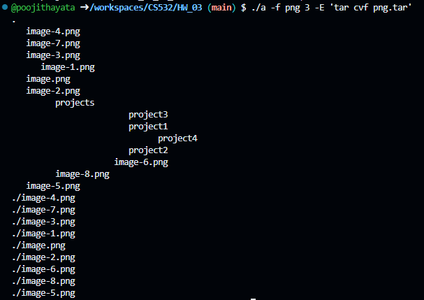
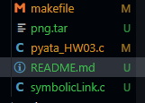
11. ./a -s 1024 -e 'wc -l'
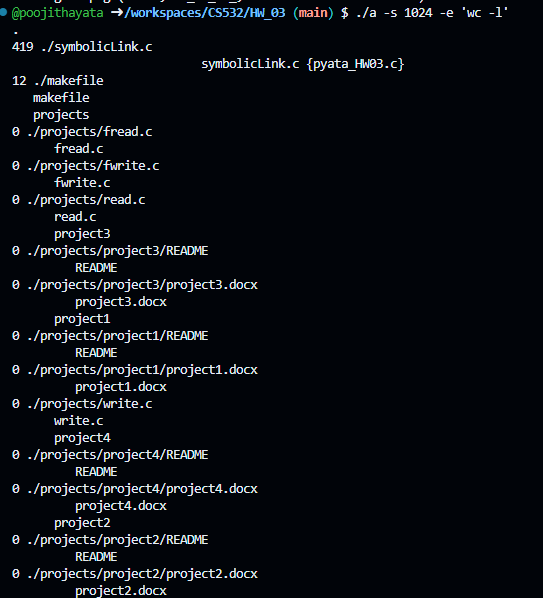