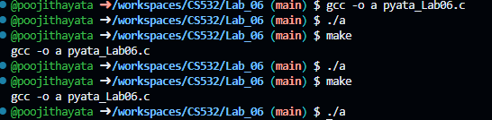
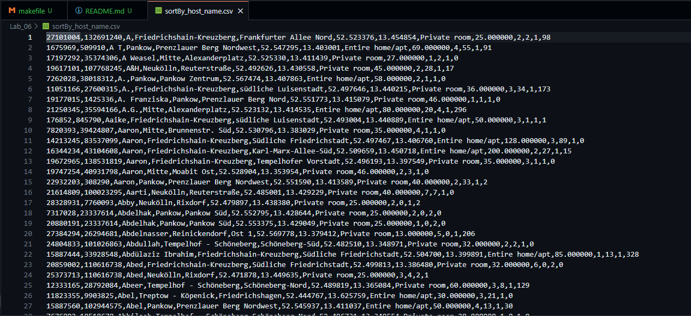
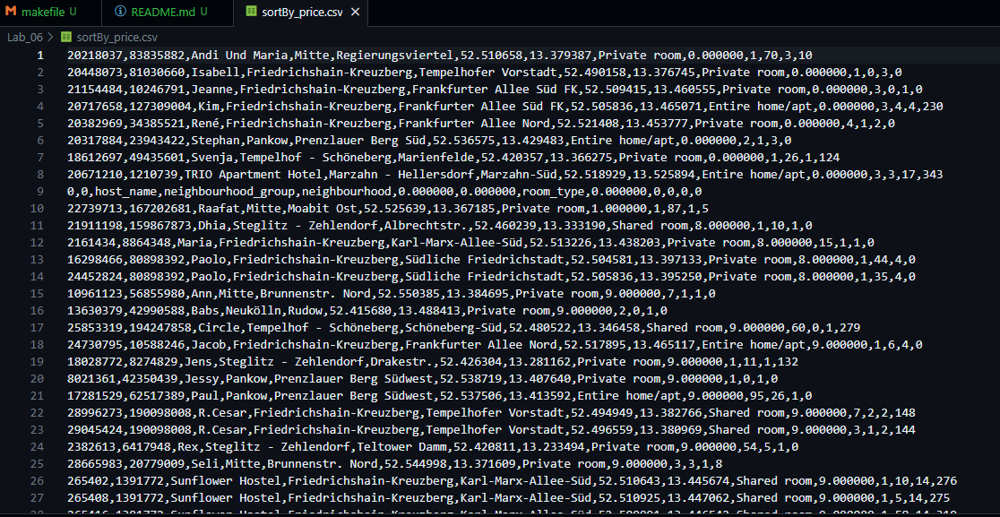

# Lab_06  
- Introduction to standard I/O libraries and I/O streams.

## Execution
- Compile the pyata_Lab06.c file with either one of the commands :  
    make or gcc -o a pyata_Lab06.c
- Then it will create a.exc file so we need to excure the following command:   
    ./a

# Output
- The output of this program is the sorted csv files with name and price
    - File sorted with name : sortBy_host_name.csv
    - File sorted with price : sortBy_price.csv

# Code
- The main function contains the following variables
    - list_items : Struct data type
    - line : char data type
    - i, count : int datatype.
- The main function calls the following functions :
    - qsort() : To sort the list based on the parameter passed.
- The main function creates the files and sorts the csv file with name and then with price and stores in their respective files.

# Images
- 
- 
-  