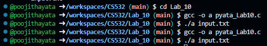
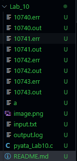
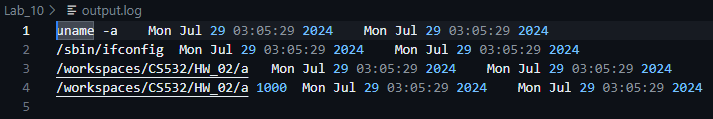

# Lab_10
- Introduction to sharing b/w parent and child process

## Execution
- Compile the pyata_Lab10.c file with either one of the commands :  
    gcc -o a pyata_Lab06.c
- Then it will create a.exc file so we need to excure the following command:   
    ./a input.txt

# Output
- The output of this program is :
    - List of .err and .out files
    - output.log

# Code
- The main function contains the following 
    - fp : To open the file specified during the command line.
    - The main function reads the input file and executes the each command in the input file.
    - The child process executes and the parent process waits.
    - i, count : int datatype.
- The main function calls the following functions :
    - log_Function() : To ouput the start time and end time for a particular command

# Images
- 
- 
- 